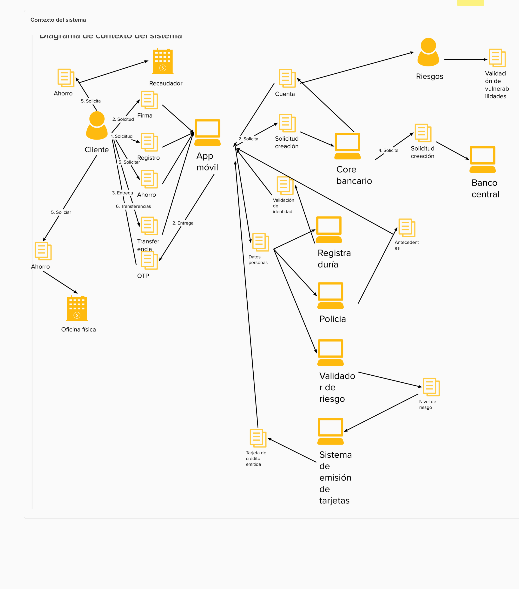

# Sistema gestión digital de cuentas de ahorro

## Contexto de la empresa

Cangre corp, compañía financiera, como parte de su estrategia de transformación digital desea permitir a sus clientes abrir cuentas de ahorro de manera completamente digital. Todo a través de un app móvil.

Geografía de uso: El Sistema está dirigido a clientes en Colombia, Estados Unidos y Puerto Rico.

Usuarios: 3 millones en Colombia, 4 millones en Estados Unidos, y 0.5 millones en Puerto rico.

Proyección de crecimiento: La empresa espera crecer un 20% anual en cada uno de estos países en los próximos 5 años.

## Requerimientos:

- Para abrir la cuenta el usuario debe descargar un app móvil y acceder a la opción de registro del app, allí debe ingresar los datos y tomarse una foto con la cédula. Un sistema de reconocimiento biométrico debe validar que la cédula coincide con el rostro de la persona y con los datos ingresados.
- El usuario debe firmar digitalmente el contrato de aceptación de términos y condiciones. Para esto se le envía un OTP (One time password) al celular. Este código debe ser ingresado para firmar digitalmente y continuar con la apertura de la cuenta.
- Si el usuario ya tiene otros productos en el banco, no tiene que hacer nuevamente el registro. Puede usar su usuario y clave actual para realizar la autenticación y desde allí continuar el proceso de apertura de cuenta.
- Cuando se cumplen los pasos 1 y 2, se debe crear la información de apertura de la cuenta en el core bancario y en el sistema del banco central. Solo en este momento la cuenta oficialmente está creada y se puede gestionar desde otros canales de acceso como las oficinas o cajeros automáticos. 
- El usuario puede crear nuevas cuentas de ahorro sin ir a una sucursal física, Si no es posible crear la cuenta en algún sistema ya sea el Core bancario o el banco central, debe anularse la transacción en todos los sistemas.
- El sistema debe identificar una oficina de atención a la cual se asocia la cuenta haciendo uso de la ubicación del usuario. Para esto debe consultar en el sistema de sucursales cuál es la oficina más cercana.
- Si el usuario quiere ahorrar dinero lo puede hacer en una oficina física, a través de recarga virtual (Por web o móvil) o a través de los puntos de recaudo que se tienen en alianza con otros negocios (La red de aliados es diferente por país y cambia frecuentemente). La integración con los aliados se realiza a través de servicios Web de sistema a sistema.
- El usuario puede hacer transferencias a otras cuentas desde la app móvil.
- Solo se debe abrir cuentas de ahorro a personas que no tengan antecedentes legales y se debe garantizar que sea abierta por quien dice ser. La suplantación de identidad es un delito grave que afecta reputacionalmente a la entidad financiera. El origen de la información judicial proviene de los sistemas de la policía, y la identidad se valida a través de la registraduría.
- El área de riesgos de la compañía hoy hace procesos de análisis de vulnerabilidades corriendo algunos programas analíticos sobre la base de datos de cuenta oficial de la compañía. Las cuentas abiertas digitalmente deben ser validadas sin generar afectación en los programas analíticos.
- Estadísticamente, está comprobado en este tipo de negocios que un usuario que intenta realizar el proceso de registro y no puede hacerlo, jamás regresa. Por esta razón es muy importante que el sistema se mantenga operativo.
- El negocio financiero es muy competitivo y este proyecto hace parte de una estrategia de continuidad del negocio a largo plazo.
- Cómo parte de su estrategia de diferenciación de mercado, el banco quiere ofrecer a los clientes un nuevo producto tarjeta de crédito con aprobación inmediata y sin cuota de manejo. Dicha asignación solo se da si el usuario acepta y se cumplen 150 reglas de negocio que determinan si el usuario tiene un nivel de riesgo aceptable.  Si las condiciones se cumplen, se debe notificar automáticamente a la empresa emisora de tarjetas de crédito para que haga la emisión y el envío. Esto es solo un experimento de muchos otros que se realizarán para captar mercado.
- Es conocido por el negocio que la competencia planea lanzar un producto similar el 10 de agosto, por ende no es negociable que el sistema salga a producción el 10 de julio.
- El banco cotiza en bolsa de Nueva York, por ende debe cumplir con la regulación SOX.

## Contexto técnico:

- El sistema core bancario solo admite 10 transacciones por minuto para creación de cuentas.
- En los momentos picos de apertura de cuenta (Los fines de mes al mediodía), el sistema core bancario se torna muy lento y rechaza peticiones.
- Por ley la información del cliente debe residir en cada país.
- Los fines de semana entre las 10 pm y las 3 am, se presentan incrementos del 80% en las transacciones de transferencia de dinero entre cuentas. Al finalizar este periodo el sistema vuelve a condiciones normales de ejecución.

## Análisis de TI:

El área de tecnología realizó un análisis preliminar del reto de diseño y estableció los siguientes aspectos críticos en el diseño:

- Este sistema realiza muchas integraciones por ende se requiere información para gestionar los errores que se presenten fácilmente.
- En el contexto de la aplicación móvil se pueden presentar errores, dichos errores deben llegar a un lugar para sus análisis aún en condiciones de desconexión de red.
- El sistema de la registraduría genera cobros por transacción muy altos, es preocupante que estos costos se disparen en el desarrollo y las pruebas.
- El sistema será desarrollado por más de 50 personas dispersas en 4 geografías.
- Los sistemas externos pueden cambiar en cualquier momento, en caso de cambio el impacto debe ser focalizado sin afectar otros módulos del sistema.

## Información de los stake holders.

Dado el nivel de importancia del proyecto para la organización, en el proyecto estarán involucrados.

- El gerente de retail banking, quien entregará toda la información relacionada con el negocio y la estrategia de crecimiento, es una persona no técnica.
- El líder de desarrollo mobile y front end. Una persona con mucha experiencia técnica, sin la visión completa del negocio.
- Analista de seguridad informática.
- DevOps engineer, una persona que apoya transversalmente la automatización del proceso de desarrollo y entrega de soluciones.
- Cloud engineer. Conoce toda la infraestructura cloud de la entidad financiera, pero no conoce los sistemas on.premise.
- Legacy technical leader. Conocer a la perfección los sistemas legado y sus modelos de integración.
- Analista funcional de core banking. Conoce a la perfección el negocio y los sistemas que implementan el proceso desde un punto de vista funciona, no técnico.

Los stake holders están muy interesados en la realización de un ejercicio de diseño arquitectónico que les ayude a resolver las siguientes preguntas.

- ¿Como garantizar el logro de las metas de crecimiento a través de una plataforma tecnológica sólida?
- ¿Cómo puedo paralelizar la construcción de los componentes con equipos que puedan trabajar con independencia?
- ¿Todos los componentes deben ser desarrollados a la medida o puedo integrar sistemas de paquete?
- ¿Es posible lograr los objetivos de negocio coexistiendo con los sistemas legados?

Por último y para que tengas más información contextual, Cangrecorp tiene su arquitectura de negocio alineada con BIAN (Banking Industry Architecture Network) y por ende puedes usar como referencia BIAN para entender sus capacidades de negocio

